<h1 align="center">Apple-gate Property Services LTD - Handyman Services</h1>

[View the live project here](https://handyman-services-fullstackapp-ba60a0c4d688.herokuapp.com/)

Apple-gate Property Services LTD is your trusted solution for all household maintenance and handyman needs. We specialize in providing a wide range of services, including:

__Painting:__ Transform your space with professional-grade painting, price starting from £100. 
__Assembling Various Units/Drawers:__ Get your furniture assembled effortlessly, with price starting from £40.
__Assistance in packing__ when moving in and out the house, price from £50.
Our user-friendly website ensures seamless booking of these services. The My Bookings feature allows customers to easily book, view, update, or cancel their appointments, ensuring a hassle-free experience. Customers can provide key information such as their name, email, phone number, preferred service, and additional booking details.

With efficient functionality and a responsive design, the website operates smoothly, ensuring that no two bookings clash. From registration to booking confirmations, Applegate Property Services LTD offers a streamlined, easy-to-use platform for all your home service needs.

## Index – Table of Contents
* [User Experience (UX)](#user-experience-ux) 
* [Features](#features)
* [Design](#design)
* [Planning](#planning)
* [Technologies Used](#technologies-used)
* [Testing](#testing)
* [Deployment](#deployment)
* [Credits](#credits)

## User Experience (UX)

### User stories :

* __US01__: As a **registered user**, I can **view all my past and upcoming bookings,** so that **I can keep track of my service requests.**
  - *Acceptance criteria 1:* Bookings are displayed in a list or table format.
  - *Acceptance criteria 2:* The list shows the service name, date, time, and additional information.

* __US02__: As a **registered user,** I can **create a new booking,** so that **I can schedule a service based on my preferences.**
  - *Acceptance criteria 1:* A booking form allows users to select a service, provide details, and choose an available date and time.
 

* __US03__: As a **registered user,** I can **update an existing booking,** so that **I can change the service details or reschedule it.**
  - *Acceptance criteria 1:* An “Edit” button next to each booking opens the booking form pre-filled with existing data.
  - *Acceptance criteria 2:* Validation ensures the new date and time do not conflict with existing bookings.

* __US04__: As a **registered user,** I can **delete a booking,** so that **I can remove a scheduled service that I no longer need.**
  - *Acceptance criteria 1:* A “Delete” button is available for each booking, with a confirmation prompt.
  - *Acceptance criteria 2:* The booking is permanently removed from the database after deletion.

* __US05__: As a **registered user,** I can **filter my bookings,** so that **I can easily find upcoming or past bookings.**
  - *Acceptance criteria 1:* The bookings list includes a filter or search bar for upcoming or past services.
  - *Acceptance criteria 2:* The filter works based on service type, date, or status.

* __US06__: As a **registered user,** I can **register for an account,** so that **I can manage my bookings on the platform.**
  - *Acceptance criteria 1:* A registration form asks for the user’s name, email, and phone number.
  - *Acceptance criteria 2:* Users must verify their email before accessing booking features.

* __US07__: As a **registered user,** I can **log in to my account,** so that **I can access my bookings and make changes.**
  - *Acceptance criteria 1:* Users are prompted for their username and password to log in.
  - *Acceptance criteria 2:* Users who are logged in are redirected to the homepage with personalized options like "My Bookings."

* __US08__: As **an authenticated user,** I can **log out,** so that **I can securely end my session on the platform.**
  - *Acceptance criteria 1:* The navigation bar shows a “Logout” button when the user is logged in.
  - *Acceptance criteria 2:* After logout, the user is redirected to the homepage, and booking features are no longer accessible.

* __US09__: As a **website visitor,** I can **view details of services before booking,** so that **I can understand the services and their pricing.**
  - *Acceptance criteria 1:* The homepage displays a grid of services with a brief description and price.
  - *Acceptance criteria 2:* Clicking on a service leads to a detailed page with more information and the option to book.

* __US10__: As a **registered user,** I can **see notifications for booking conflicts,** so that **I can select another available date or time.**
  - *Acceptance criteria 1:* The booking system checks for existing appointments at the selected time.
  - *Acceptance criteria 2:* If there is a conflict, the user is informed and prompted to select another available slot.

## Features

Applegate Property Services LTD is a full-fledged web application built using the Django framework, designed to offer a seamless user experience for customers looking to book handyman services. This project offers services such as painting,assembling furniture, and packing and moving, with an efficient booking system that prevents scheduling conflicts. Users can create, read, update, and delete their bookings and manage their accounts.

### Existing Features

 - __F01 Navigation Bar:__

The navigation bar provides a consistent design and placement across all pages, ensuring easy and intuitive access to key sections of the site. It features a company logo alongside a link to the homepage for quick navigation. When a user is not logged in, options to register or sign in are prominently displayed. Once a user is signed in, the navigation adjusts to show links for My Bookings and Sign Out, alongside a personalized touch with the user's name and a user icon.

Designed with responsiveness in mind, the navigation bar adapts seamlessly to various screen sizes. On smaller devices, it transforms into a compact 'hamburger' menu, allowing for smooth access to all the necessary links without cluttering the interface.

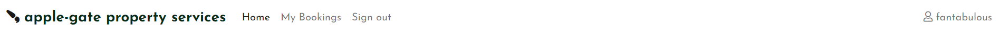
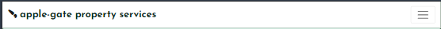

-__F02 Landing page, name & text__

At the top of the landing page (home page) there is an area that includes an AI generated handyman photograph simulating the activities of given services and a text overlay which together clearly identify the purpose of the site as a place to find and book household services from a company called Apple-gate Property Services LTD.

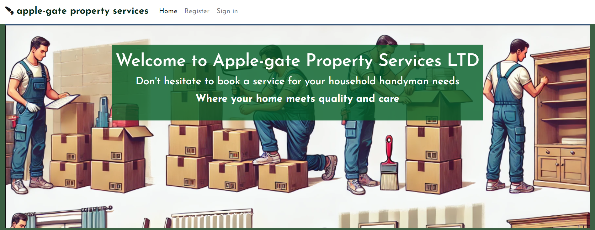

- __Booking Button__

When an authenticated user is logged in, a __Book a Service__ button will be displayed at the bottom of each service column that displays a feature service image, service description and service price information.

__F03 User Authentication (Register, Login, Logout)__

User authentication methods were implemented to ensure that if a user wants to book a service, they would either have to login if they are already registered or register first then make a booking request. The registration form also has an option for if user wants to view their password if they click on the __eye icon__.

Login and logout pages were created to facilitate full and secure authentication. Each time a user logs in or out, a session message feedback displays below the navbar. If a user trys to login with either an incorrect password or username, an on-screen feedback will be given for them to enter correct username or password. 

A required feature was also implemented to ensure a user has provided both their username and password fields.

- *__Register or Sign in to book a service:__* 
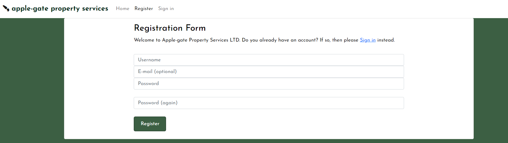

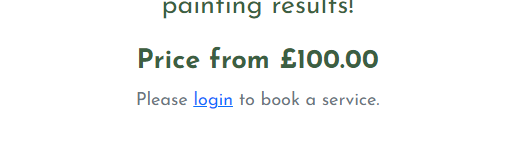

- *__Login/Logout__* 
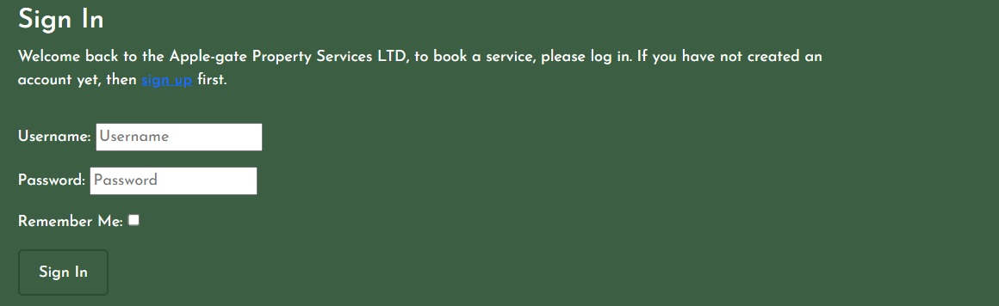
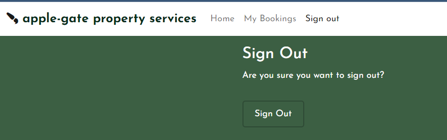

-*__On-screen alerts__*
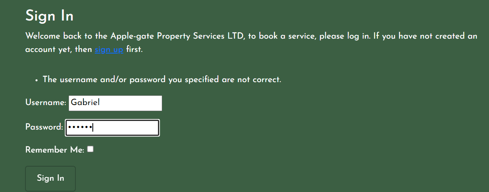
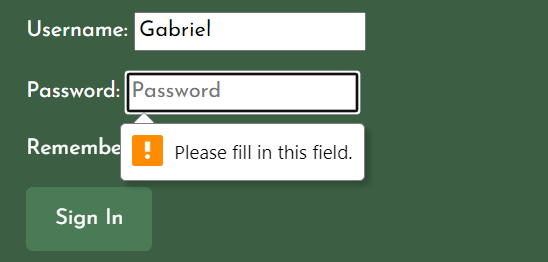

- *__Session Management:__*

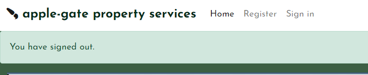

__F04 Booking System__

The booking form page has a corresponding service feature image and the description together with the associated price information.
When a user wants to create a booking, they will have to provide their Name, Email, Contact Number, Service type, Date and time, Approved tickbox and any additional required customer information regarding the service they want assistance with.

If a user books the same date and time that has already been booked into the system, a feedback message will be displayed to the user for them to choose a different time or date.

A *Confirm Booking* submit button is displayed at the bottom of the booking form to trigger a service booking action.

Summernote was also implemented to allow authenticated users to use rich text when inputting their additional information regarding the booking.

- *__Booking Conflict:__*

- *__Customised Date and time picker__*
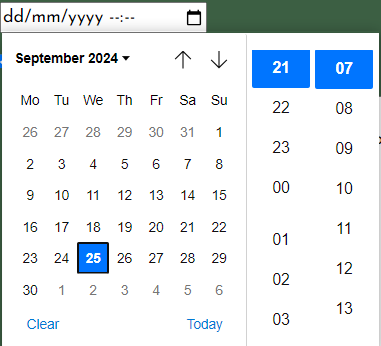

-*__Summernote Rich Text Input panel__*
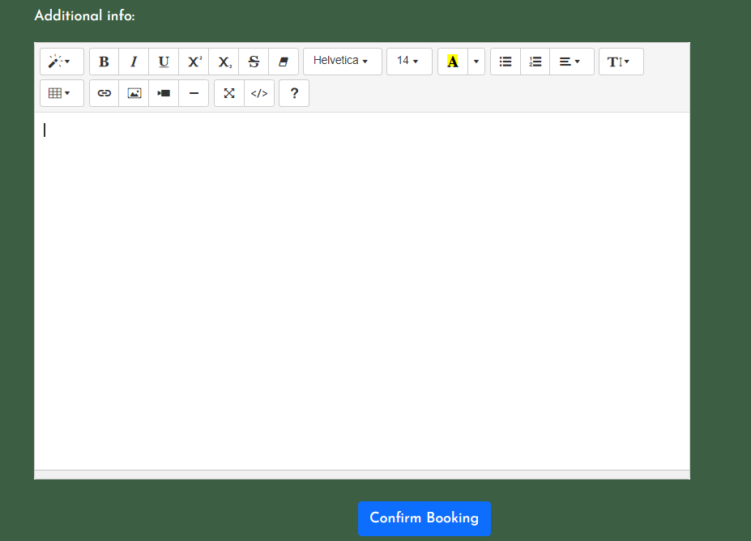

__F05 My Bookings Page__ 

My bookings page contains two main sub headings of __Your Upcoming Service Bookings__ and __Past Bookings__. These two panes will ammend dependant on the frequency of authenticated user bookings. Each upcoming service ticket will be displayed in the respective row from the aforementioned sub headings. Each service ticket that has already been attended to and carried out will be appended under the Past bookings row. 

Each scheduled ticket will display key information such as __Service Title__, __Service Info__, __Service Price__, __Customer Additional Info__, and __Date and Time__ fields. A blue phone icon will be displayed together with customer contact number and a green confirm tickbox icon will appear next to a __Confirmed__ text to alert the user that the service has been confirmed. Once a user confirms their booking, effectively an orange __Awaiting Confirmation__ will be attached to the ticket until the super user who has access to the __approved__ check button has checked to confirm booking.

The __Create, Read, Update and Delete__ functionality was implemented to ensure that if a user wants to cancel a ticket, a red __Cancel Booking__ nav button is shown at the top of the ticket. An __Edit Button__ was implemented incase a user wants to change the ticket information and once they confirm, the ticket information updates accordingly. Both the *Cancel Booking* and *Delete* buttons once they are clicked, a confirmation dialog is shown at the top modal window.

- *__Booking Management:__* 
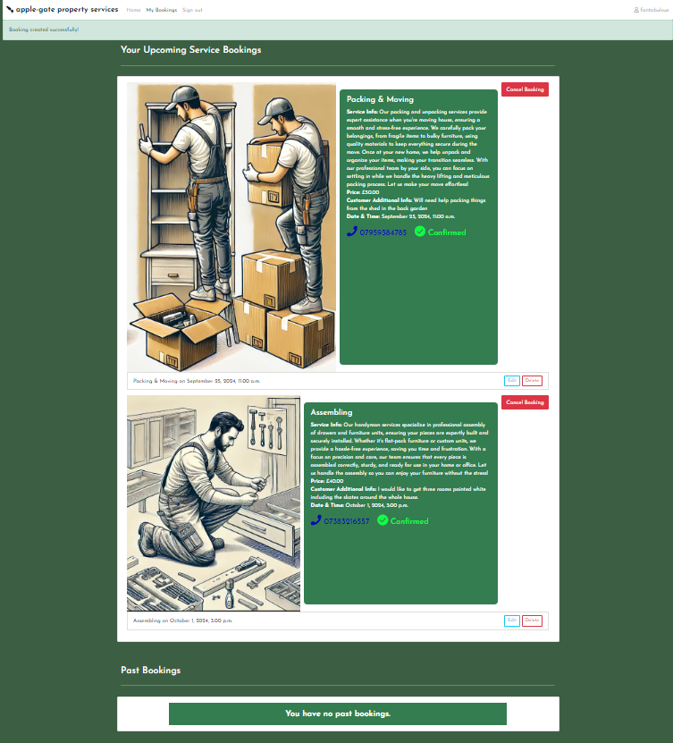

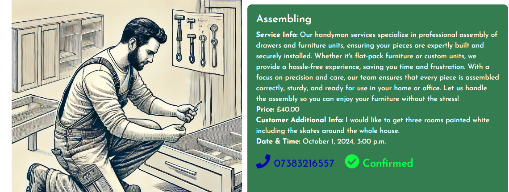

- *__CRUD (Create, Read, Update, Delete) Functionality:__*
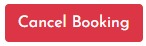

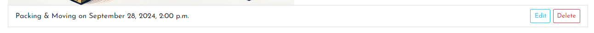

__Super User - Booking Form with Approved Field View__
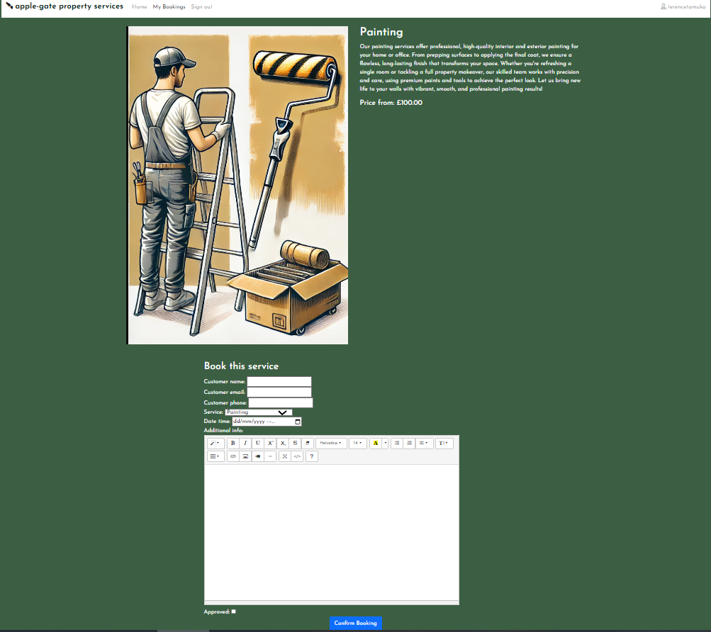

__Super User - Edit Booking Form with Approved Field View__

__Non Super User - Booking Form View__
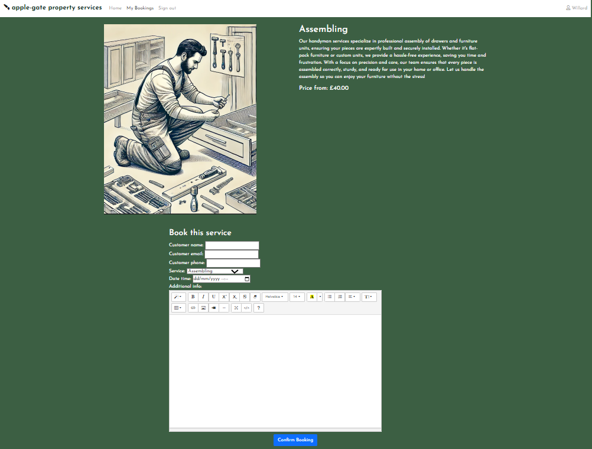

__Non Super User - Edit Booking Form View__
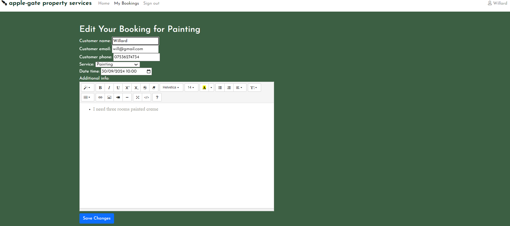

__Booking On Screen Confirmation Message__
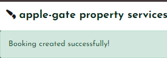

__Booking Deletion Confirmation Message__
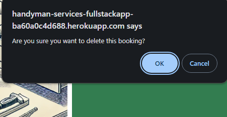

__F06 PostgreSQL Database & Super User Creation__

The admin interface provides a graphical user interface (GUI) for managing the data related to Service and Booking models. Administrators can easily create, read, update, and delete services and bookings without needing to interact directly with the database.
Admins can add new services (like Painting, Assembling, Packing) with relevant details (price, description, featured image) and manage existing services.
Similarly, they can manage bookings, approve pending bookings, and modify or cancel them as needed.

Non-technical users (such as business managers or customer service representatives) can use the Django admin interface to manage services and bookings without needing to understand the underlying code.
The admin panel’s auto-generated forms make it simple to add, edit, or delete entries, significantly reducing the learning curve.

- *__Database Intergration:__* 
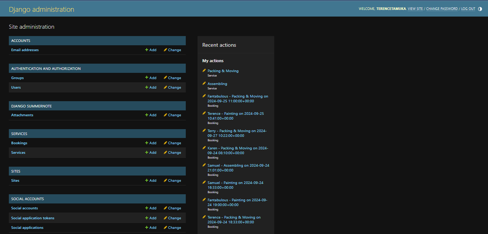

*__User Booking a service using Django admin page__*
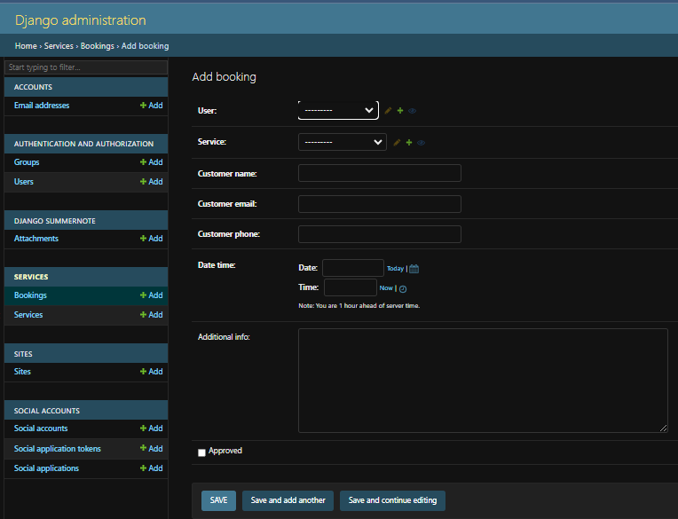

*__User feedback to confirm that a booking was successful__*
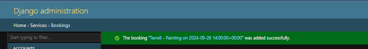

*__Django Admin Page for manipulating bookings__*
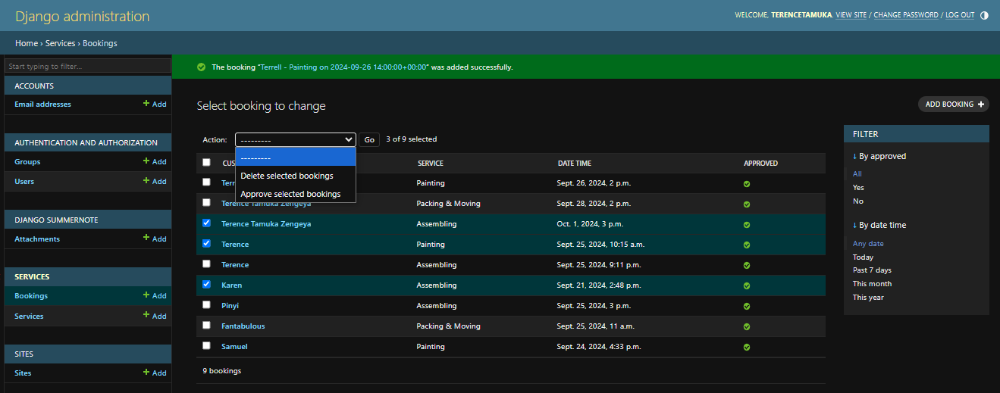

__F07 Responsive Design with Bootstrap__

Responsive design ensured that the website functions and looks good on all devices, from desktops to smartphones. By using Bootstrap, which provides a grid system and pre-built classes for styling, the website automatically adjusts based on the screen size. In the project base code, the below headings highlight a more indepth summary of responsive design with Bootstrap and why content focuses on trust also.

*__Navbar__*: The navbar-toggler is implemented to collapse the menu on smaller screens, enhancing usability for mobile users.
Container-fluid: This class helps make sure the content adapts to different screen widths.
Bootstrap classes (col-md-8, offset-md-2) are used for layout, ensuring that elements are correctly spaced on different screen sizes.

 - Form styling is critical for user experience and accessibility. In the code:

 - Bootstrap form controls (form-control, form-group): These ensure that the forms are styled consistently and responsively, with inputs adapting to different devices.

 - CSRF Token: Security is integrated using Django’s CSRF protection to keep the forms secure.

 - Button Styling: Buttons like "Sign in" use Bootstrap's btn classes, making them clear and recognizable as actionable elements.

 - Eye-Catching Theme
An eye-catching theme engages users and sets the tone for the handyman property services brand.

 - Google Fonts: Fonts like Josefin Sans, Kanit, and Raleway are loaded, creating a modern and professional appearance.

 - Font Awesome icons (e.g., user icons, social media icons) are used to create visual interest, aiding both aesthetics and usability.

 - Branding: The custom logo and favicon help maintain brand identity.

 - Content Focused on Trust
Building trust through content is vital for user engagement and retention. The website builds trust by:

 - Clear Navigation: The navbar directs users to essential pages like "Sign in," "Register," and "My Bookings," ensuring transparency and ease of access.

 - Personalized Experience: Displaying the logged-in user's name in the navbar ({{ user.username }}) reassures users they are securely signed in.

 - Social Proof: Linking to social media pages like GitHub, LinkedIn, and Twitter shows users that the company is connected to trusted networks.

 - Secure Practices: Use of security best practices, such as user authentication and form validation, adds credibility.

  

__Bootstrap Integration:__
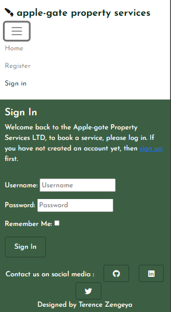

__Social Proof with Hover Effect__

__Eye-Catching Theme:__
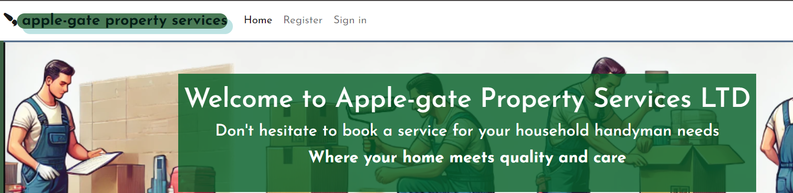

-__How Existing Features Support User Stories__

The User Stories in the [User Experience (UX)](#user-experience-ux) part of this document are numbered 1 to 10. The existing features are listed above as F01 to F07. Below is a traceability matrix cross-referencing the user stories with the features, illustrating which features support which stories :

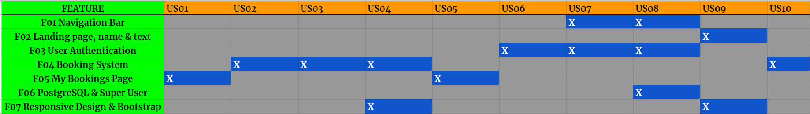

### Features which could be implemented in the future

There are quite a number of features which could come in handy for future development and some of them are:

__1. Enhanced Booking Management System__

  - __Booking Reminders and Notifications:__ Add email or SMS notifications to remind users of upcoming service appointments or booking changes.

  - __Service Availability Calendar:__ Implement a calendar view where users can see available dates and times for different services before they book, ensuring greater convenience in selecting their preferred times.

  - __Recurring Bookings:__ Allow users to create recurring bookings for periodic services (e.g., weekly cleaning), making it easier to schedule regular appointments.

__2. Service Reviews and Ratings__

  - __User Ratings & Reviews:__ After completing a service, users can leave a rating and review for the service provider. This can help new users in choosing services based on feedback and improve the overall trust and credibility of the platform.

  - __Review Management:__ Allow administrators to monitor, manage, or respond to reviews for service providers, ensuring that the feedback system is constructive and fair.

__3. Loyalty and Referral Programs__

  - __Loyalty Points System:__ Implement a rewards system where users earn points for booking services, leaving reviews, or referring new customers. Points can be redeemed for discounts on future services.

  - __Referral Program:__ Add a referral feature that allows users to invite others to the platform and earn discounts or rewards when their referrals book a service.

__4. Service Provider Profiles and Portfolio__

  - __Service Provider Pages:__ Create dedicated pages for service providers, where users can view details about the provider, including their experience, reviews, and portfolio of past work.

  - __Portfolio Display:__ Allow service providers to showcase their previous projects or services with images and descriptions, giving users more information when deciding which provider to choose.

__5. Advanced Filtering and Sorting for Bookings__

  - __Advanced Search and Filter Options:__ Users can filter services by price range, rating, availability, or type of service. This will help users quickly find the most relevant service.

  - __Sort Booking History:__ Allow users to sort their past bookings by date, type of service, or status (confirmed, canceled, awaiting confirmation).

__6. Multiple Payment Integration__

  - __Payment Gateway Integration:__ Support multiple payment methods (credit card, PayPal, Apple Pay, etc.) to provide flexibility to users during the booking process.

  - __Payment History:__ Create a section in user accounts where users can view and download receipts or payment history for completed services.

__7. Discount Codes and Promotions__

  - __Promo Codes:__ Introduce the ability for administrators to create promotional codes that users can apply during booking to receive discounts.

  - __Seasonal Promotions:__ Run time-limited promotions (e.g., holiday sales) that offer discounted services for a certain period.

__8. User Account Enhancements__

  - __Profile Management:__ Allow users to update their account information such as profile picture, phone number, or preferred payment methods.

  - __Multiple Addresses:__ Give users the ability to store multiple service addresses (e.g., home, office) for faster and more convenient booking.

__9. Customer Support Integration__

  - __Live Chat Support:__ Implement a real-time chat feature so that users can ask questions or get assistance directly from the platform without needing to call or email.

  - __Help Desk and FAQs:__ Add a comprehensive help center with FAQs and articles to assist users with common questions or booking issues.

__10. Mobile App Development__

  - __Mobile Application:__ Develop a mobile app version of the platform for both iOS and Android to make booking services and managing bookings easier for users on the go.

  - __Push Notifications:__ Send push notifications for reminders, booking confirmations, and special promotions to users who have the mobile app installed.

## Design

### Wireframes

Desktop Wireframes

  -__Desktop-View - Home Page Unregistered user view__

  -__Desktop-View - Home Page Registered user view__

__Desktop-View - My Bookings Page__
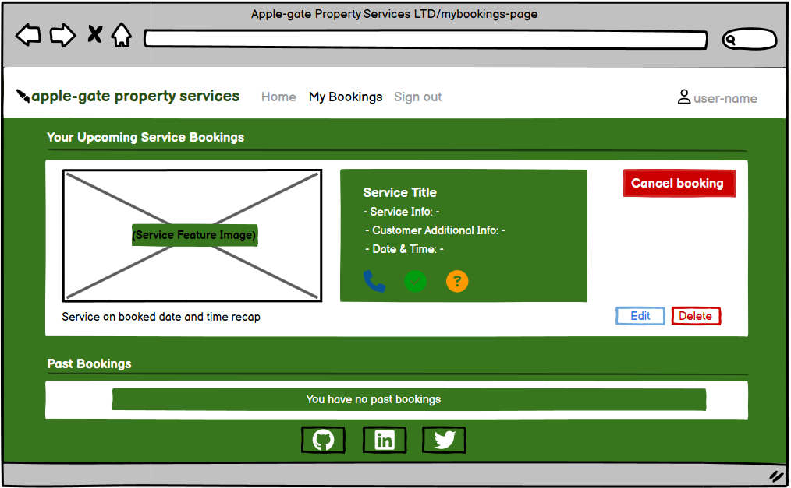

__Desktop-View - Edit Booking Page__
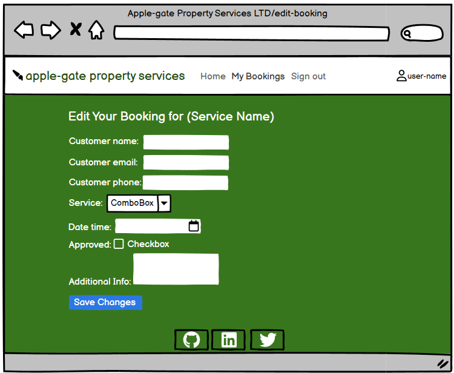

__Desktop-View - Register Page__
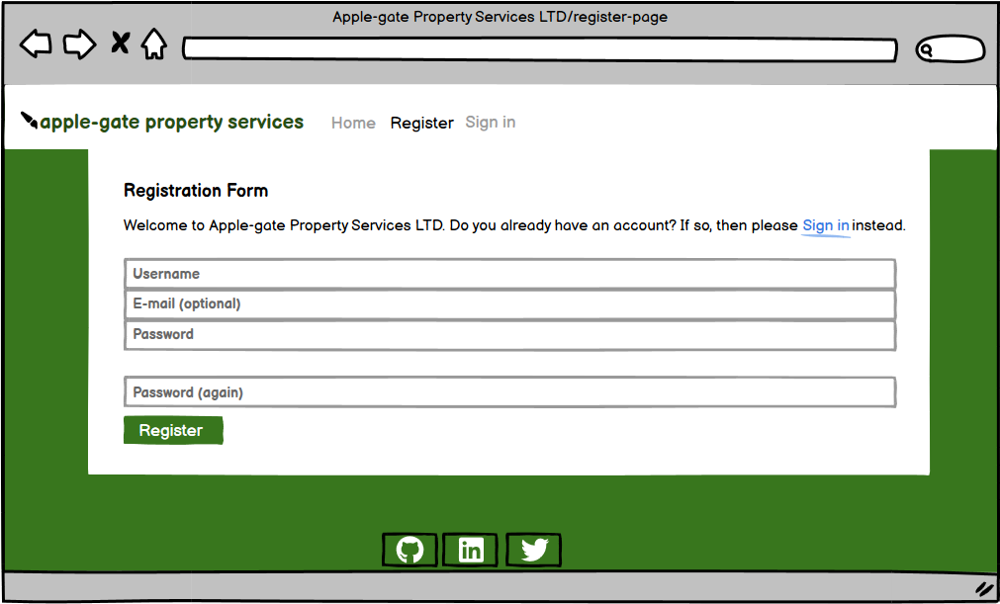

__Desktop-View - Login Page__
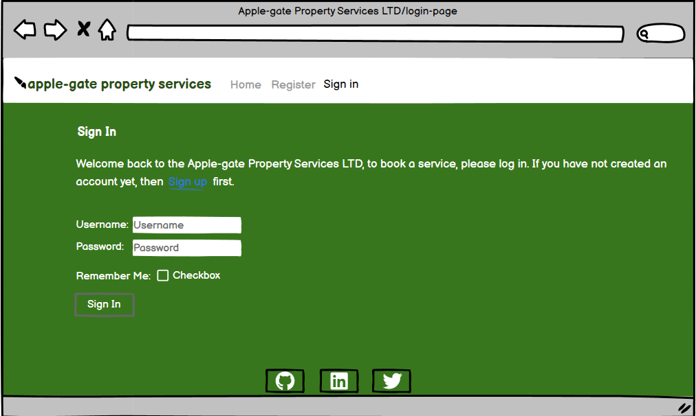

__Desktop-View - Logout Page__
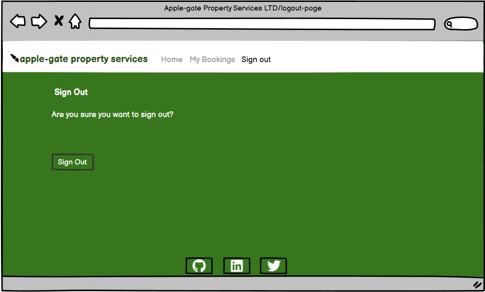

__Desktop-View - Book a service Page__
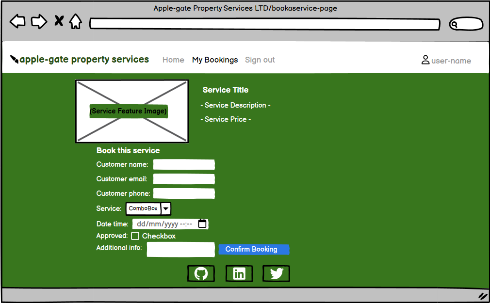

  

iPad View Wireframes

__Homepage view for registered, unregistered user & Edit Booking pages__

__My bookings, Registration Form & Booking form Pages__
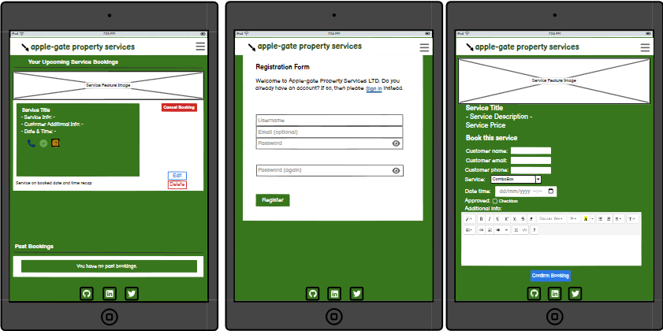

__Sign Out, Non Super User Booking Form & Super User Booking Form View__
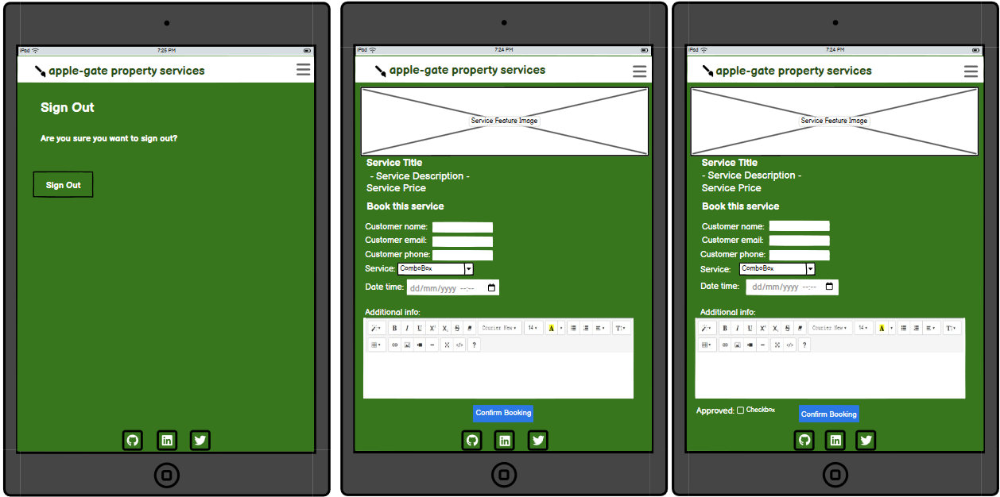

__Sign In Page View__
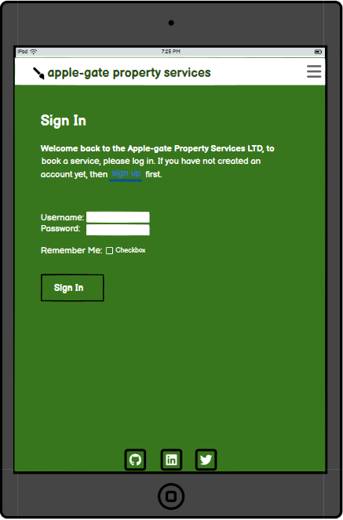

Mobile View Wireframes

__Home page view for Unregisteered User and Registered User__
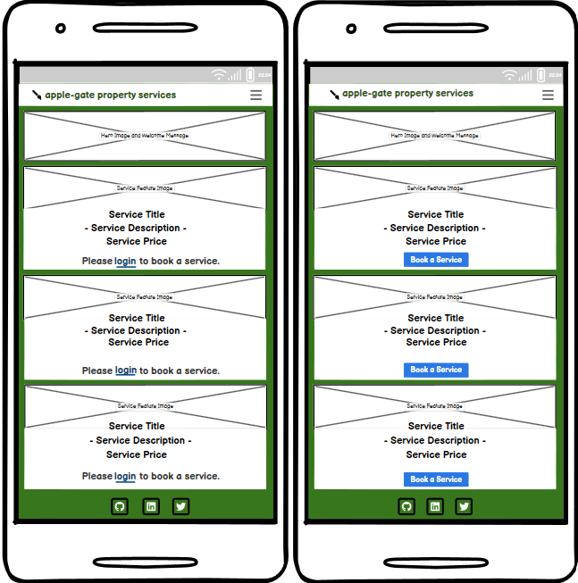

__Booking Form view for Registered user and Super user Approved view__
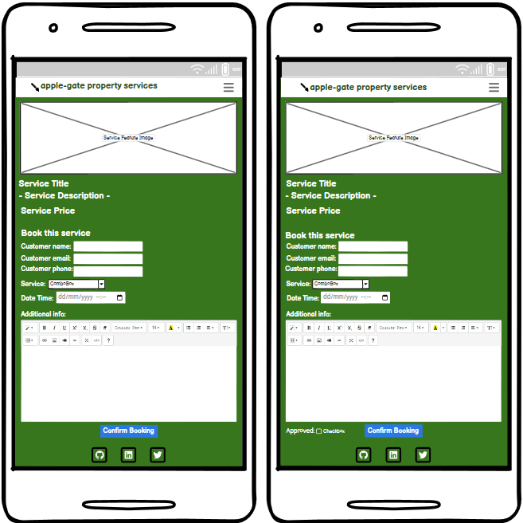

__My Bookings Page - Before and After Approval__
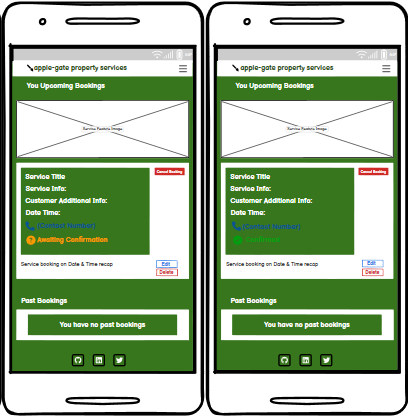

__Edit Booking Page for Registered and Super User Views__
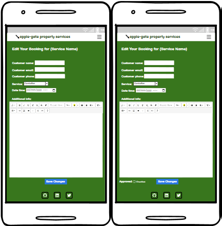

__Registration Form, Sign In & Sign Out Pages__
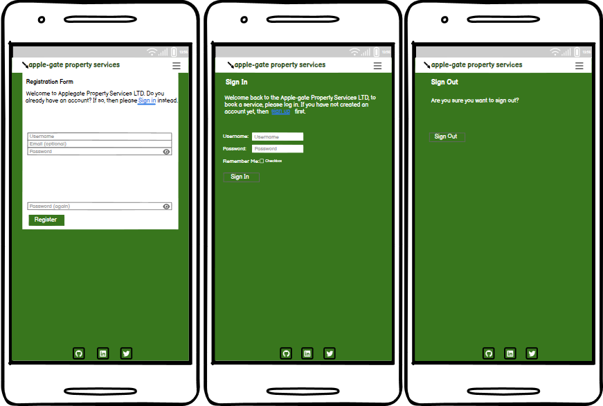

-   ### Entity-Relationship diagrams and summarisation for DBMS
    
      __Entity-Relationships Schematic__
      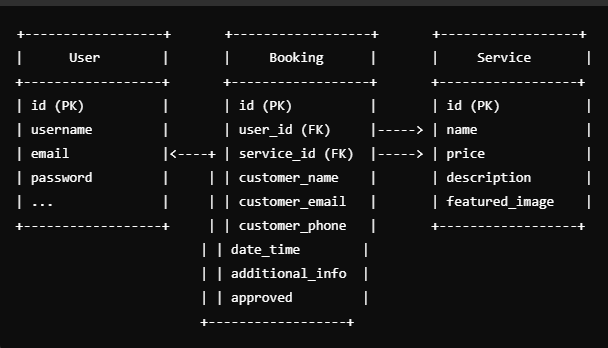

      

      __ER Diagram Breakdown__

      __Entities:__

      -__User:__ Represents the customer who makes the booking. This is a foreign key referencing Django's built-in User model.

      -__Service:__ Represents different services like "Painting", "Assembling", and "Packing & Moving". Each service has attributes such as:
      *__name__* (the type of service),
      *__price__* (cost of the service),
      *__description__* (details about the service), and the
      *__featured_image__* (an optional image associated with the service).

      -__Booking:__ Represents a customer's booking of a service. Key attributes include:
      *__customer_name,__*
      *__customer_email,__*
      *__customer_phone_number,__*
      *__date_time__* (when the booking is scheduled),
      *__additional_info__* (optional additional booking details or specific requirements), and
      *__approved__* (whether the booking is confirmed or not).

      -__Relationships:__

      __User to Booking:__ This is a one-to-many relationship. A user can have multiple bookings, but a booking is associated with one user.

      __Service to Booking:__ This is a one-to-many relationship. A service can be booked multiple times, but a booking is associated with one service.

      -__Unique Constraint:__

      The Booking model has a unique constraint combining __date_time and service,__ meaning a particular service cannot be booked multiple times at the same date and time (to prevent double-booking).

      -__Summary Methodology:__

      __Service:__ Manages a list of services offered, each with a name, price, and optional image. The service choices are predefined in the system.

      __Booking:__ Handles customer bookings for the services. The customer details, booking time, and additional info are stored in the booking. The approved field is used to track whether a booking is confirmed or pending approval.

      __User:__ Utilizes Django’s built-in User model for customer authentication and identification, linked via a foreign key in the Booking model.

## Planning

A GitHub Project with linked Issues was used as the Agile tool for this project.  User Stories with acceptance criteria were defined using GitHub Issues and development of code for these stories was managed using a Kanban board.  All of the User Stories were linked to a 'parent' Epic issue to show how they all supported the over-arching goal of the project.  The acceptance criteria were tested as each story moved to 'Done' and were also included in the final pre-submission manual testing documented in the Testing section of this README.

The Epic, User Stories and Kanban board can be accessed here : [Handyman Services Agile Tool](https://github.com/users/TerenceTamuka/projects/5)

## Technologies Used

### Languages Used

-   [HTML5](https://en.wikipedia.org/wiki/HTML5)
-   [CSS3](https://en.wikipedia.org/wiki/Cascading_Style_Sheets)
-   [Jquery](https://jquery.com/)
-   [Python](https://www.python.org/)

### Frameworks, Libraries & Programs Used

-   [Google Fonts:](https://fonts.google.com/) used for the Josefin Sans font
-   [Font Awesome:](https://fontawesome.com/) was used to add icons for aesthetic and UX purposes.
-   [Git:](https://git-scm.com/) was used for version control by utilising the Gitpod terminal to commit to Git and Push to GitHub.
-   [GitHub:](https://github.com/) is used as the respository for the project code after being pushed from Git. In addition, for this project GitHub was used for the agile development aspect through the use of User Stories (GitHub Issues) and tracking them on a Kanban board.
-   [dbdiagram.io](https://dbdiagram.io/home) was used to create the Entity Relationship diagrams for the application data model
-   [Balsamiq:](https://balsamiq.com/) was used to create the wireframes during the design process.
-   [Django](https://www.djangoproject.com/) was used as the framework to support rapid and secure development of the application
-   [Bootstrap](https://getbootstrap.com/) was used to build responsive web pages
-   [Gunicorn](https://gunicorn.org/) was used as the Web Server to run Django on Heroku
-   [dj_database_url](https://pypi.org/project/dj-database-url/) library used to allow database urls to connect to the postgres db
-   [psycopg2](https://pypi.org/project/psycopg2/) database adapter used to support the connection to the postgres db
-   [Cloudinary](https://cloudinary.com/) used to store the images used by the application
-   [Summernote](https://pypi.org/project/django-summernote/) used to have rich text for users when creating or editing their booking for a service in the ADDITIONAL TEXT filed.
-   [Django allauth](https://django-allauth.readthedocs.io/en/latest/index.html) used for account registration and authentication
-   [Django crispy forms](https://django-crispy-forms.readthedocs.io/en/latest/) used to simplify form rendering
-   [jquery library](https://ajax.googleapis.com/ajax/libs/jquery/1.12.4/jquery.min.js) used to fade out alert messages
-   [Django testing tools](https://docs.djangoproject.com/en/3.2/topics/testing/tools/) used for python mvt testing
-   [Jest](https://jestjs.io/) - used to test jquery in script.js functions
-   [coverage](https://coverage.readthedocs.io/en/coverage-5.5/) used to check how much of the python code has been covered by 
automated tests

## Testing

### Validator Testing 

- [HTML Validator](https://validator.w3.org/)

    - Since this project utilises Django templates, the html has been validated by manually executing through the application pages, copying the source of the rendered pages and then validating this version of the html using the W3C Validator (link shown above).  HTML  for the Django admin site pages was not edited so has not been validated here.  The Signup/registration form, Login and Logout pages from Django allauth were remodelled and so have been validated, with results below.

Validation result for index.html

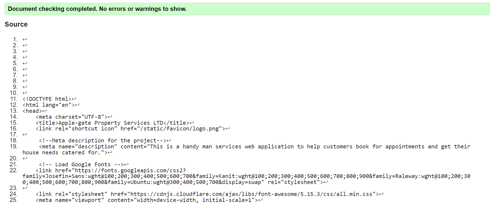

Validation result for Registration Form Page

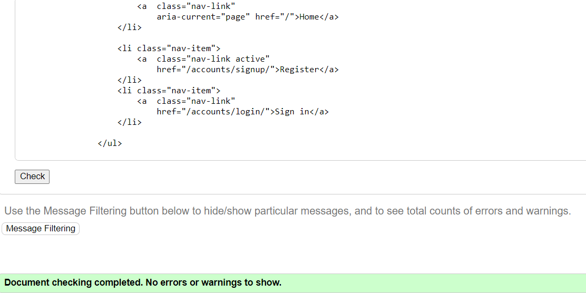

Validation resign for Sign In Page

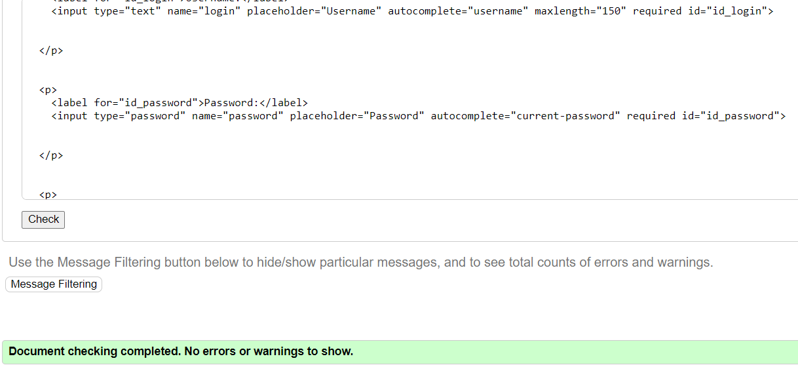

Validation result for Booking Page

There were a few Summernote issues encountered during the validatotion process which didnt resulted in the code not fully validated.
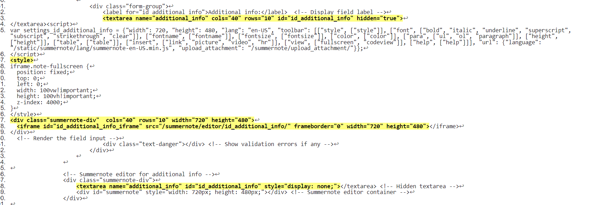

Validation result for My Bookings Page

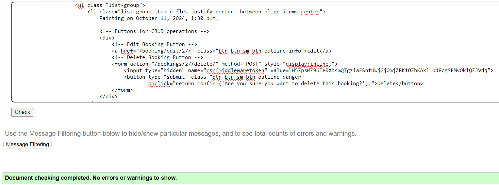

Validation result for Edit Booking Page

Similar to the booking page, the validation for this page also encapsulated the Summernote feature which cased issues while validating but besides the summernote feature, the code still passes.

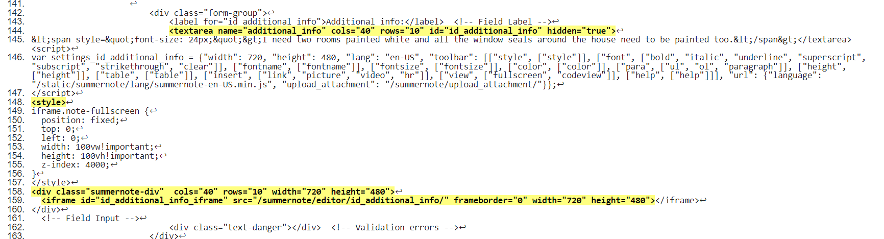

Validation result for Sign out Page

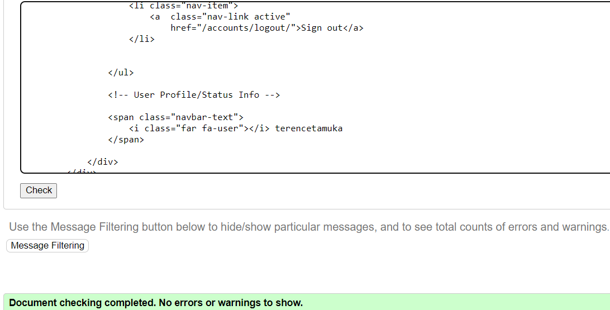

- [CSS Validator](https://validator.w3.org/nu/#textarea)

Validation result for the Project CSS

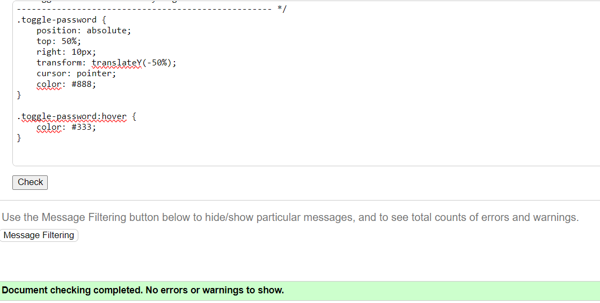

  - __1. Global Styles Body:__ Sets the background color to a dark green shade (#3C5F43) and applies a maximum width of 125rem. It ensures consistency in typography using the "Josefin Sans" font family and sets the global text color to white (#fff).

  - __2. Navbar and Branding Brand:__ The brand name in the navbar has a prominent font size (1.4rem) with bold text. Hover effects on the brand include changing the background and text color with a smooth transition, adding a shadow, and a slight scaling animation to make it interactive and visually engaging.

  - __3. Jumbotron Styling Jumbotron:__ This section uses a hero image background with a responsive design, filling the entire area with a cover effect. The jumbotron has padding and a z-index setting to ensure its content stays on top and visually distinct.

  - __4. Typography & Text Colors Text Colors:__ Utility classes for text colors are defined to quickly apply white or black text to elements where needed.

  - __5. Welcome and Booking Message Styling Welcome/Booking Message:__ These sections are styled to stand out with larger font sizes (1.5rem), bold text, and centered alignment. The background color is semi-transparent (rgba(4, 95, 39, 0.811)), giving it an overlay effect while still blending with the background.

  - __6. Card Styling (Titles, Text, Prices) Card Titles, Text, and Prices:__ This defines consistent styles for card elements with a strong emphasis on typography. Titles, text, and prices all have a 1.5rem font size, with titles and prices having bold text and a specific color (#3C5F43), keeping them visually connected.

  - __7. Button Styling General Buttons:__ Buttons like .btn-signup, .btn-block, and .fab are styled with a background color of dark green (#3C5F43) and white text. They feature transitions for hover effects that change the background and border colors, enhancing user interactivity.

  - __8. Footer Styling:__ The .footer-bg is a minimal class that ensures text within the footer section is styled in white, matching the overall light-on-dark theme of the application.

  - __9. Booking Summary and Icons:__ *Summary:* The .booking-summary section is designed to present key booking details, with a semi-transparent green background that aligns with the primary color scheme.
*Icons:* The .booking-icons classes colorize various icons, like phone icons (#0805ad) and confirmation indicators (#0bff44 for confirmed bookings, #ffc107 for awaiting confirmation), making them intuitive and visually distinct.

  - __10. Toggle Password Field:__ The .toggle-password class adds functionality to password fields, allowing users to reveal or hide their passwords. The icon is positioned within the input field and changes color on hover to indicate interactivity.

__Overall Design Goals__ The CSS design prioritizes:

  - Consistency: A cohesive green and white color palette is used throughout.
  - User Experience: Buttons and interactive elements include hover effects and smooth transitions to improve engagement.
  - Readability: Typography and spacing are optimized for readability, ensuring that key information like prices and messages stand out.
  - Responsiveness: The layout and elements are designed to be responsive, ensuring they adapt well to different screen sizes.
  - This styling enhances the professionalism and user-friendliness of the web application, creating a modern and consistent user interface.

### Browser Compatibility

- Chrome DevTools was used to test the responsiveness of the application on different screen sizes.  In addition, testing has been carried out on the following browsers :
    - Google Chrome version 9.0.4606.81 (64-bit)
    - Firefox version 93.0 (64-bit)
    - Microsoft Edge 94.0.992.38 (64-bit)
 
    
### Manual Testing Test Cases and Results

| **User Story (US)** | **Test Case** | **Acceptance Criteria** | **Expected Outcome** | **Actual Outcome** | **Pass/Fail** |
| ------ | ------ | ------ | ------ | ------ | ------ |
| **US01** : As a registered user, I can view all my past and upcoming bookings, so that I can keep track of my service requests. | Verify that past and upcoming bookings are displayed on the user’s dashboard. | 1. Bookings are displayed in a list or table format. 2. The list shows the service name, date, time, and additional info. | Past and upcoming bookings should be listed in a table, displaying details like service name, date, and time. | The booking list is displayed correctly, with all the required information visible. | Pass |
| **US02** : As a registered user, I can create a new booking, so that I can schedule a service based on my preferences. | Verify that the user can create a new booking using a form. | 1. A booking form allows users to select a service, provide details, and choose an available date and time. | A new booking form should allow users to select a service, enter details, and schedule a date and time. | The booking form works correctly, and bookings are created successfully. | Pass |
| **US03** : As a registered user, I can update an existing booking, so that I can change the service details or reschedule it. | Verify that the user can edit a booking by updating details. | 1. An "Edit" button next to each booking opens the booking form pre-filled with existing data. 2. Validation ensures the new date and time do not conflict with other bookings. | The user should be able to edit a booking, with pre-filled details and conflict checking. | Editing is functional, pre-filled data is accurate, and validation prevents conflicts. | Pass |
| **US04** : As a registered user, I can delete a booking, so that I can remove a scheduled service that I no longer need. | Verify that a user can delete a booking and that it is removed from the database. | 1. A "Delete" button is available for each booking, with a confirmation prompt. 2. The booking is permanently removed from the database after deletion. | The user should see a delete button, a confirmation prompt, and the booking should be removed. | The delete button works as expected, with confirmation and permanent removal from the database. | Pass |
| **US05** : As a registered user, I can filter my bookings, so that I can easily find upcoming or past bookings. | Verify that the user can filter bookings by date, status, or service type. | 1. The bookings list includes a filter or search bar for upcoming or past services. 2. The filter works based on service type, date, or status. | The user should be able to filter bookings by criteria such as service type, date, or status. | Filtering works correctly for both past and upcoming bookings. | Pass |
| **US06** : As a registered user, I can register for an account, so that I can manage my bookings on the platform. | Verify that users can register for an account. | 1. A registration form asks for the user’s name, email, and phone number. 2. Users must verify their email before accessing booking features. | Users should be able to register and must verify their email to access bookings. | The registration form works, and email verification is required. | Pass |
| **US07** : As a registered user, I can log in to my account, so that I can access my bookings and make changes. | Verify that users can log in with valid credentials. | 1. Users are prompted for their username and password to log in. 2. Users who are logged in are redirected to the homepage with personalized options like "My Bookings." | Users should be able to log in and access their bookings. | Login works as expected, and the user is redirected to their dashboard. | Pass |
| **US08** : As an authenticated user, I can log out, so that I can securely end my session on the platform. | Verify that users can log out and are redirected appropriately. | 1. The navigation bar shows a “Logout” button when the user is logged in. 2. After logout, the user is redirected to the homepage, and booking features are no longer accessible. | The user should see a "Logout" button, and booking features should be restricted after logout. | Logout works as expected, and the user is redirected with restricted access. | Pass |
| **US09** : As a website visitor, I can view details of services before booking, so that I can understand the services and their pricing. | Verify that service details are visible on the homepage and in detail pages. | 1. The homepage displays a grid of services with a brief description and price. 2. Clicking on a service leads to a detailed page with more information and the option to book. | Visitors should see services displayed on the homepage with descriptions and detailed pages. | Services are visible on the homepage with descriptions, and detailed pages are accessible. | Pass | 
| **US10** :  As a registered user, I can see notifications for booking conflicts, so that I can select another available date or time. | Verify that conflict notifications are shown when trying to book a time slot that’s already taken. | 1. The booking system checks for existing appointments at the selected time. 2. If there is a conflict, the user is informed and prompted to select another available slot. | Users should receive notifications of booking conflicts with available alternatives. | Conflict validation works, and users are informed of conflicts with suggestions. | Pass |

__Summary of Testing__

| **Category** | **Pass** | **Fail** | **Total Tests** |
| ---- | ---- | ---- | ---- |
| Functionality Testing | 10 | 0 | 10 |
| Responsive Design | Pass | N/A | Tested on mobile, tablet, desktop (Chrome, Safari, Firefox) |
| Performance Testing | Pass | N/A | Tested on mobile, tablet, desktop | 
| Security Testing | Pass | N/A | CSRF, XSS, and SQL injection tested |

__Overall Conclusion__
All tested user stories and acceptance criteria passed successfully. The website provides a seamless user experience with intuitive navigation, responsive design across multiple devices, and strong security features for handling user bookings.

### Known bugs

- Currently no known bugs.

## Deployment

Outlined below are the steps to clone this project repository, along with the necessary configurations and deployment procedures. A summary of similar steps can be found in the CI Cheat Sheet provided by Code Institute.

__Cloning the Repository:__ Instructions for cloning this project repository.

__Setting Up the Application and PostgreSQL Database on Heroku:__ Guidance on creating the application and configuring the PostgreSQL database on Heroku.

__Configuring Cloudinary:__ Steps to configure Cloudinary for hosting images used within the application.

__Linking the Heroku Application to the GitHub Repository:__ Instructions on connecting the Heroku app to the GitHub repository for streamlined deployments.

__Final Deployment Process:__ A walkthrough of the final steps required for successful application deployment.

### How to Clone the Repository 

Follow the steps below to clone this repository and set up the application locally:

  - Navigate to the GitHub repository. https://github.com/TerenceTamuka/handy-man-services-fullstack-project
  - Click on the "Code" button, select HTTPS, and copy the URL provided.
  - Open your GitBash terminal and move to the directory where you want the cloned project to be stored.
  - In the terminal, run the following command:
  - git clone <https://github.com/TerenceTamuka/handy-man-services-fullstack-project> 
  - Press Enter to initiate the cloning process.
  - To install the necessary dependencies for the application, use the command:
  - pip install -r requirements.txt
  - While developing or running the app locally, ensure that DEBUG=True is set in the settings.py file.
  - To push any changes made to the cloned repository back to GitHub, follow these steps:
  - Add the files you modified:
  - git add <"filename">  or use git add .  to add all changed files.
  - Commit the changes with a message describing them:
  - git commit -m "description of changes"
  - Push the changes to the repository:
  - git push
  - Note: Any updates pushed to the master branch will be reflected on the live application once it's redeployed from Heroku.

### Create Application and Postgres DB on Heroku

__1. Log into Heroku:__ visit [heroku](https://dashboard.heroku.com/)

__2. Create a New Application:__ In the Heroku dashboard, click the __Create new app button.__ If you have a new account, you’ll see a prompt on the screen to create an app. Otherwise, select New from the dropdown menu at the top right and choose Create a new app.

__3. App Configuration:__ On the Create New App page, enter a unique name for your app and select a region, then click Create app.

__4. Add Postgres Database:__ After creating the app, navigate to the __Resources__ tab. In the "Add-ons" section, search for Heroku Postgres. Choose it from the list and click Submit Order Form in the dialog that appears. 

__5. Configure Environment Variables:__ Next, go to the Settings tab and click Reveal Config Vars. Ensure that the DATABASE_URL has been automatically configured.
  - Add a new Config Var called DISABLE_COLLECTSTATIC and set its value to 1.
  - Add another Config Var named SECRET_KEY and assign it a random string of characters (letters, numbers, and symbols).

__6. Update settings py:__ Modify your settings.py file to use these environment variables for database configuration and secret key management:
  - DATABASES = {'default': dj_database_url.parse(os.environ.get('DATABASE_URL'))}
  - SECRET_KEY = os.environ.get('SECRET_KEY')

__7. Migrate the Database:__ In your Gitpod terminal, initialize the database schema by running the migration command:
  - python3 manage.py migrate

__8. Update Requirements:__ Ensure your __requirements.txt__ file includes all necessary dependencies by running:
  - pip3 freeze --local > requirements.txt

__9. Commit and Push Changes:__ Push any local modifications to GitHub by committing and pushing as usual:
  - git add .
  - git commit -m "Updated for Heroku deployment"
  - git push

__10. Run the Application Locally:__ To run the app on localhost, make sure the SECRET_KEY and DATABASE_URL environment variables are set in your env.py file.

App Creation On Heroku Dashboard

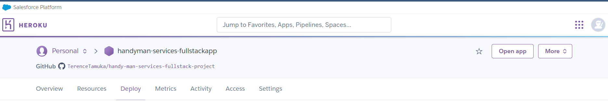

Connecting Postgres DB on Heroku

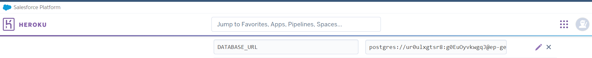

### Configure Cloudinary to host images used by the application

__1. Sign Up for Cloudinary:__ Visit the [Cloudinary](https://cloudinary.com/) website and create an account if you don't already have one. During registration, provide your name, email address, and set up a password. When prompted for your "primary interest," select Programmable Media for image and video API.
After completing the sign-up process, verify your account through the confirmation email you receive. This will grant you access to your Cloudinary dashboard.

__2. Get the API Environment Variable:__ Once in your Cloudinary dashboard, locate the __API Environment__ variable and copy its value by clicking the __Copy to clipboard button.__

__3. Configure Cloudinary in Heroku:__ Log in to your [Heroku](https://dashboard.heroku.com/) account and navigate to the app’s Settings section. Click Reveal Config Vars to view and manage environment variables.
Add a new Config Var with the name CLOUDINARY_URL and paste the value you copied from Cloudinary. Ensure you remove the "CLOUDINARY_URL=" prefix from the copied string before saving it.

__4. Set Up for Local Deployment:__ To run the app locally, add the __CLOUDINARY_URL__ and its value to your env.py file so your application can use Cloudinary when running on localhost.

Cloudinary Media Upload Dashboard

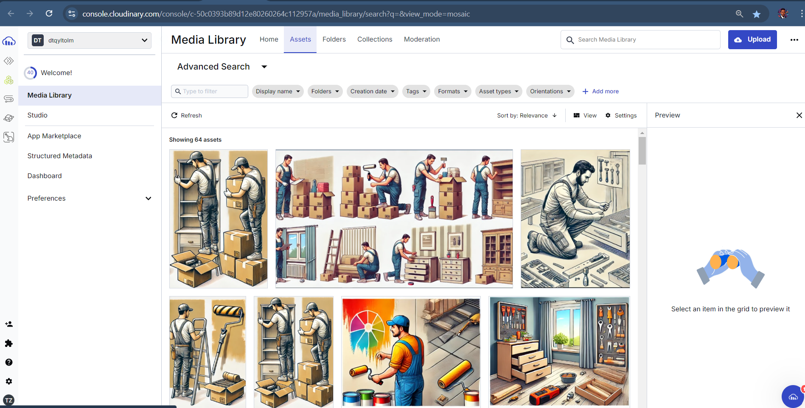

### Connect the Heroku app to the GitHub repository

__1.__ Navigate to the "Deploy" tab on the Application Configuration page in Heroku.

__2.__ Choose GitHub as your deployment method. If prompted, confirm the connection between Heroku and GitHub.

__3.__ In the search bar, enter the name of your GitHub repository (for this project, it's [handy-man-services-fullstack-project](https://github.com/TerenceTamuka/handy-man-services-fullstack-project)) and click Connect to link the Heroku app with your repository.

__4.__ Scroll down to the deployment options. You can either enable Automatic Deploys (to redeploy the app whenever changes are pushed to GitHub) or select Manual Deploy for on-demand deployments. This project opted for manual deployment.

__5.__ To launch the application, return to the Application Configuration page and click the __Open App__ button.

GitHub Repository Connection With Heroku App

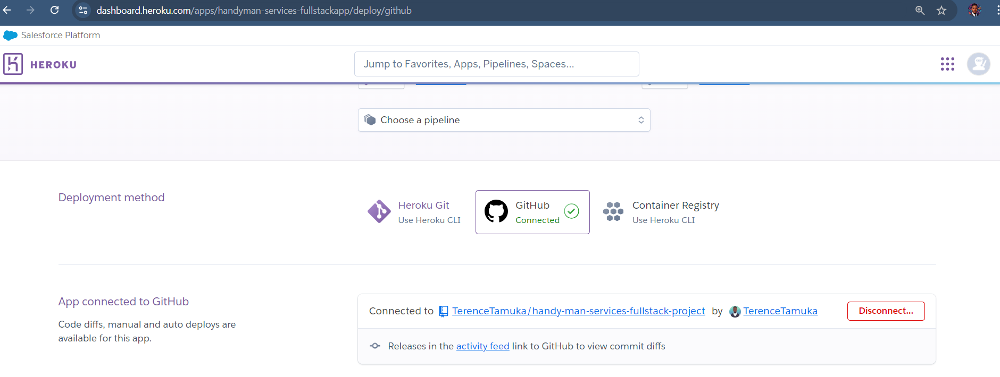

### Final Deployment steps
Once code changes have been completed and tested on localhost, the application can be prepared for Heroku deployment as follows :
- Set DEBUG flag to False in settings.py
- Ensure this line exists in settings.py to make summernote work on the deployed environment (CORS security feature): X_FRAME_OPTIONS = 'SAMEORIGIN'
- Ensure requirements.txt is up to date using the command : pip3 freeze --local > requirements.txt
- Push files to GitHub
- Ensured to run the python3 manage.py COLLECTSTATIC before final deployment to ensure all the latest static files are collected since the DISABLE STATIC function variable was deleted on heroku.
- On the Heroku dashboard go to the Deploy tab for the application and click on deploy branch
- The Code Institute's "Django Blog Cheat Sheet" was a key resource used throughout the process of installing and configuring frameworks and libraries, setting up the database management system (DBMS), and preparing the application for deployment. : [CI Cheat Sheet](https://codeinstitute.s3.amazonaws.com/fst/Django%20Blog%20Cheat%20Sheet%20v1.pdf)

#### The live link to the application can be found here - [Apple-gate Property Services LTD](https://handyman-services-fullstackapp-ba60a0c4d688.herokuapp.com/) 

## Credits 

- Used this README https://github.com/elainebroche-dev/pf4-wayfarers-guided-hikes/blob/main/README.md as a base skeleton for my README.

- [Chat GPT](https://chatgpt.com/) - AI tool used to generate the images used in the project website. Also some of the coding ideas to make the app function in full.

- [Telusko](https://www.youtube.com/watch?v=SIyxjRJ8VNY) - wacthed some django tutorials on this channel to help with my ideation developemnt.

- [Programming with Mosh](https://www.youtube.com/watch?v=rHux0gMZ3Eg) - Wacthed this tutorial to help me understand key concepts of templates, forms and models used in this project.

### Media 
- The Josefin Sans font used was imported from [Google Fonts](https://fonts.google.com/)
- Fontawesome was used for icons, including icons for user Icon when signed in and footer section social media links on GitHub, LinkedIn & twittwer- [Font Awesome](https://fontawesome.com/v4/icons/)
- The applicaiton favicon logo was created on: [Favicon](https://favicon.io/logo-generator/) 
- The project Mockup was produced on - [Am I Responsive](https://ui.dev/amiresponsive?url=https://handyman-services-fullstackapp-ba60a0c4d688.herokuapp.com/)
  
  
### Acknowledgments

- My uncle by the name of Trevor is the one who had the handyman services brand idea since he is the one who in the future will be carrying out the project services.