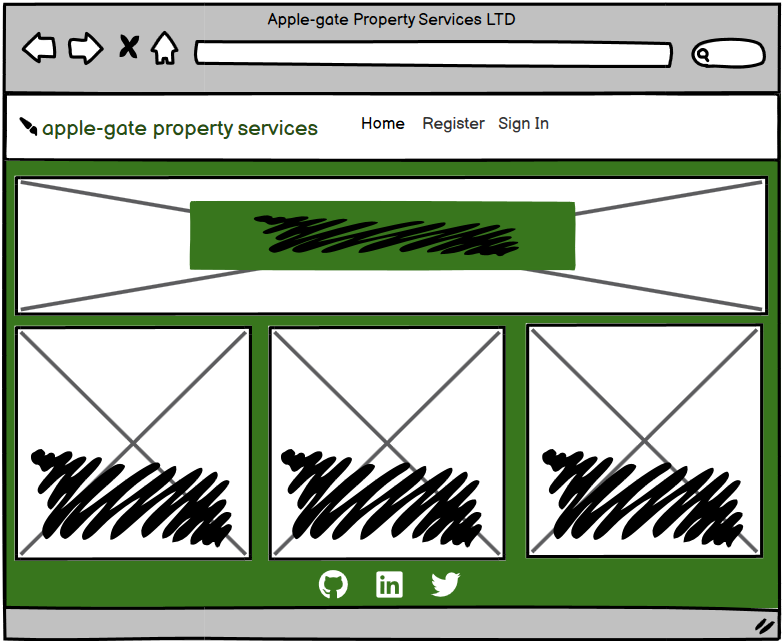
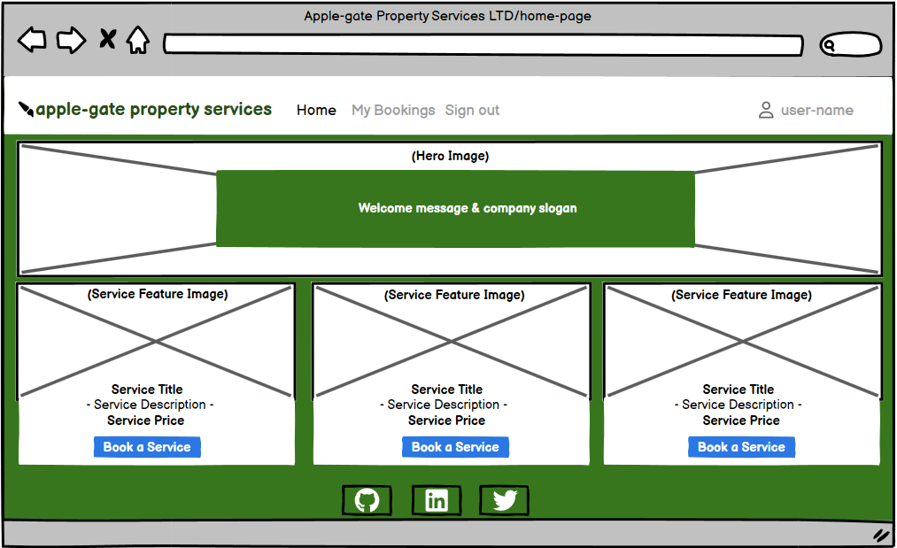

<h1 align="center">Apple-gate Property Services LTD - Handyman Services</h1>

[View the live project here](https://handyman-services-fullstackapp-ba60a0c4d688.herokuapp.com/)

Apple-gate Property Services LTD is your trusted solution for all household maintenance and handyman needs. We specialize in providing a wide range of services, including:

__Painting:__ Transform your space with professional-grade painting, price starting from £100. 
__Assembling Various Units/Drawers:__ Get your furniture assembled effortlessly, with price starting from £40.
__Assistance in packing__ when moving in and out the house, price from £50.
Our user-friendly website ensures seamless booking of these services. The My Bookings feature allows customers to easily book, view, update, or cancel their appointments, ensuring a hassle-free experience. Customers can provide key information such as their name, email, phone number, preferred service, and additional booking details.

With efficient functionality and a responsive design, the website operates smoothly, ensuring that no two bookings clash. From registration to booking confirmations, Applegate Property Services LTD offers a streamlined, easy-to-use platform for all your home service needs.

## Index – Table of Contents
* [User Experience (UX)](#user-experience-ux) 
* [Features](#features)
* [Design](#design)
* [Planning](#planning)
* [Technologies Used](#technologies-used)
* [Testing](#testing)
* [Deployment](#deployment)
* [Credits](#credits)

## User Experience (UX)

### User stories :

* __US01__: As a **registered user**, I can **view all my past and upcoming bookings,** so that **I can keep track of my service requests.**
  - *Acceptance criteria 1:* Bookings are displayed in a list or table format.
  - *Acceptance criteria 2:* The list shows the service name, date, time, and additional information.

* __US02__: As a **registered user,** I can **create a new booking,** so that **I can schedule a service based on my preferences.**
  - *Acceptance criteria 1:* A booking form allows users to select a service, provide details, and choose an available date and time.
  - *Acceptance criteria 2:* Bookings are only allowed for open days and times (Mon-Sat, 9 AM - 9 PM).

* __US03__: As a **registered user,** I can **update an existing booking,** so that **I can change the service details or reschedule it.**
  - *Acceptance criteria 1:* An “Edit” button next to each booking opens the booking form pre-filled with existing data.
  - *Acceptance criteria 2:* Validation ensures the new date and time do not conflict with existing bookings.

* __US04__: As a **registered user,** I can **delete a booking,** so that **I can remove a scheduled service that I no longer need.**
  - *Acceptance criteria 1:* A “Delete” button is available for each booking, with a confirmation prompt.
  - *Acceptance criteria 2:* The booking is permanently removed from the database after deletion.

* __US05__: As a **registered user,** I can **filter my bookings,** so that **I can easily find upcoming or past bookings.**
  - *Acceptance criteria 1:* The bookings list includes a filter or search bar for upcoming or past services.
  - *Acceptance criteria 2:* The filter works based on service type, date, or status.

* __US06__: As a **registered user,** I can **register for an account,** so that **I can manage my bookings on the platform.**
  - *Acceptance criteria 1:* A registration form asks for the user’s name, email, and phone number.
  - *Acceptance criteria 2:* Users must verify their email before accessing booking features.

* __US07__: As a **registered user,** I can **log in to my account,** so that **I can access my bookings and make changes.**
  - *Acceptance criteria 1:* Users are prompted for their username and password to log in.
  - *Acceptance criteria 2:* Users who are logged in are redirected to the homepage with personalized options like "My Bookings."

* __US08__: As **an authenticated user,** I can **log out,** so that **I can securely end my session on the platform.**
  - *Acceptance criteria 1:* The navigation bar shows a “Logout” button when the user is logged in.
  - *Acceptance criteria 2:* After logout, the user is redirected to the homepage, and booking features are no longer accessible.

* __US09__: As a **website visitor,** I can **view details of services before booking,** so that **I can understand the services and their pricing.**
  - *Acceptance criteria 1:* The homepage displays a grid of services with a brief description and price.
  - *Acceptance criteria 2:* Clicking on a service leads to a detailed page with more information and the option to book.

* __US10__: As a **registered user,** I can **see notifications for booking conflicts,** so that **I can select another available date or time.**
  - *Acceptance criteria 1:* The booking system checks for existing appointments at the selected time.
  - *Acceptance criteria 2:* If there is a conflict, the user is informed and prompted to select another available slot.

## Features

Applegate Property Services LTD is a full-fledged web application built using the Django framework, designed to offer a seamless user experience for customers looking to book handyman services. This project offers services such as painting,assembling furniture, and packing and moving, with an efficient booking system that prevents scheduling conflicts. Users can create, read, update, and delete their bookings and manage their accounts.

### Existing Features

__F01 Homepage with Hero Section and Services Grid__

 - *__Hero Section:__* 

- *__Services Grid:__* 
- *__Navigation Bar:__*

__F02 Service Detail Pages__

- *__Dynamic Service Pages:__* 
- *__Booking Button__* 

__F03 User Authentication (Register, Login, Logout)__

- *__Register:__* 

- *__Login/Logout__* 
- *__Session Management:__*
__F04 Booking System__

- *__Booking Form:__* 
- *__Service Selection with Prices:__*
- *__Date and Time Validation:__*
   
- *__Business Hours:__*

- *__CRUD (Create, Read, Update, Delete) Functionality:__*
__F05 My Bookings Page__ 

- *__Booking Management:__* 

__F06 Quotations Page (Services Overview)__

- *__Service Carousel:__*

- *__Coherent Service Prices:__* 
__F07 Responsive Design with Bootstrap__

- *__Bootstrap Integration:__* T
- *__Form Styling:__* 
__F08 About Us Page__

- *__Eye-Catching Theme:__* 
- *__Content Focused on Trust:__* 
__F09 PostgreSQL Database__

- *__Database Intergration:__* 

### Features which could be implemented in the future

## Design

-   ### Wireframes

  -__Home Page Unregistered user view__

  -__Home Page Registered user view__

  

-   ### Entity-Relationship diagrams for DBMS
    
      Notes on the ER diagrams :

## Planning

A GitHub Project with linked Issues was used as the Agile tool for this project.  User Stories with acceptance criteria were defined using GitHub Issues and development of code for these stories was managed using a Kanban board.  All of the User Stories were linked to a 'parent' Epic issue to show how they all supported the over-arching goal of the project.  The acceptance criteria were tested as each story moved to 'Done' and were also included in the final pre-submission manual testing documented in the Testing section of this README.

The Epic, User Stories and Kanban board can be accessed here : [Handyman Services Agile Tool]()

## Technologies Used

### Languages Used

-   [HTML5](https://en.wikipedia.org/wiki/HTML5)
-   [CSS3](https://en.wikipedia.org/wiki/Cascading_Style_Sheets)
-   [Jquery](https://jquery.com/)
-   [Python](https://www.python.org/)

### Frameworks, Libraries & Programs Used

-   [Google Fonts:](https://fonts.google.com/) used for the Lato font
-   [Font Awesome:](https://fontawesome.com/) was used to add icons for aesthetic and UX purposes.
-   [Git:](https://git-scm.com/) was used for version control by utilising the Gitpod terminal to commit to Git and Push to GitHub.
-   [GitHub:](https://github.com/) is used as the respository for the project code after being pushed from Git. In addition, for this project GitHub was used for the agile development aspect through the use of User Stories (GitHub Issues) and tracking them on a Kanban board.
-   [dbdiagram.io](https://dbdiagram.io/home) was used to create the Entity Relationship diagrams for the application data model
-   [Balsamiq:](https://balsamiq.com/) was used to create the wireframes during the design process.
-   [Django](https://www.djangoproject.com/) was used as the framework to support rapid and secure development of the application
-   [Bootstrap](https://getbootstrap.com/) was used to build responsive web pages
-   [Gunicorn](https://gunicorn.org/) was used as the Web Server to run Django on Heroku
-   [dj_database_url](https://pypi.org/project/dj-database-url/) library used to allow database urls to connect to the postgres db
-   [psycopg2](https://pypi.org/project/psycopg2/) database adapter used to support the connection to the postgres db
-   [Cloudinary](https://cloudinary.com/) used to store the images used by the application
-   [Summernote](https://pypi.org/project/django-summernote/) used to provide WYSIWYG editing on the Hike editing screen
-   [Django allauth](https://django-allauth.readthedocs.io/en/latest/index.html) used for account registration and authentication
-   [Django crispy forms](https://django-crispy-forms.readthedocs.io/en/latest/) used to simplify form rendering
-   [jquery library](https://ajax.googleapis.com/ajax/libs/jquery/1.12.4/jquery.min.js) used to fade out alert messages
-   [Django testing tools](https://docs.djangoproject.com/en/3.2/topics/testing/tools/) used for python mvt testing
-   [Jest](https://jestjs.io/) - used to test jquery in script.js
-   [coverage](https://coverage.readthedocs.io/en/coverage-5.5/) used to check how much of the python code has been covered by 
automated tests

## Testing

### Validator Testing 

- 

### Automated Testing

  - 

### Browser Compatibility

- Chrome DevTools was used to test the responsiveness of the application on different screen sizes.  In addition, testing has been carried out on the following browsers :
    - Google Chrome version 9.0.4606.81 (64-bit)
    - Firefox version 93.0 (64-bit)
    - Microsoft Edge 94.0.992.38 (64-bit)
 
    
### Manual Testing Test Cases and Results

- 
### Known bugs

- Currently no known bugs.

## Deployment

### How to Clone the Repository 

### Create Application and Postgres DB on Heroku
- 
### Configure Cloudinary to host images used by the application
- 
### Connect the Heroku app to the GitHub repository

### Executing automated tests
- 

### Final Deployment steps
Once code changes have been completed and tested on localhost, the application can be prepared for Heroku deployment as follows :
- Set DEBUG flag to False in settings.py
- Ensure this line exists in settings.py to make summernote work on the deployed environment (CORS security feature): X_FRAME_OPTIONS = 'SAMEORIGIN'
- Ensure requirements.txt is up to date using the command : pip3 freeze --local > requirements.txt
- Push files to GitHub
- In the Heroku Config Vars for the application delete this environment variable :  DISABLE_COLLECTSTATIC
- On the Heroku dashboard go to the Deploy tab for the application and click on deploy branch

#### The live link to the application can be found here -  

## Credits 

### Code 
- 

### Content 

### Media 
- The Josefin Sans font used was imported from [Google Fonts](https://fonts.google.com/)

  
  
### Acknowledgments

- 